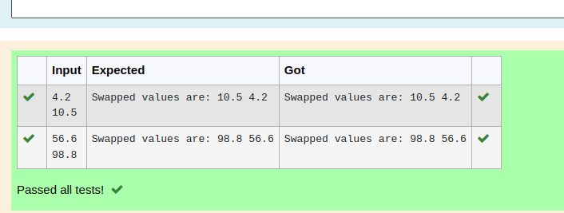

# Swapping-two-values
## AIM:
To write a python program for swapping of two values

## EQUIPEMENT'S REQUIRED: 
PC
Anaconda - Python 3.7

## ALGORITHM: 
### Step 1:
Get the two values from the user
### Step 2: 
Assign the value of second variable to a temporary variable 
### Step 3: 
Assign the value of the first variable to the second variable.
### Step 4:  
Assign the value in temporary variable to the first variable
### Step 5: 
Print both the values it would be interchanged
### Step 6: 
End the program

## PROGRAM:
```python
#Program to swap two values.
#Developed by:VISHNUPRIYA R
#Registernumber:22006962
n1=float(input())
n2=float(input())
temp=n2
n2=n1
n1=temp
print("Swapped values are: {} {}".format(n1,n2))
```
## OUTPUT:


## RESULT:
Thus the swapping of two values are successfully executed


